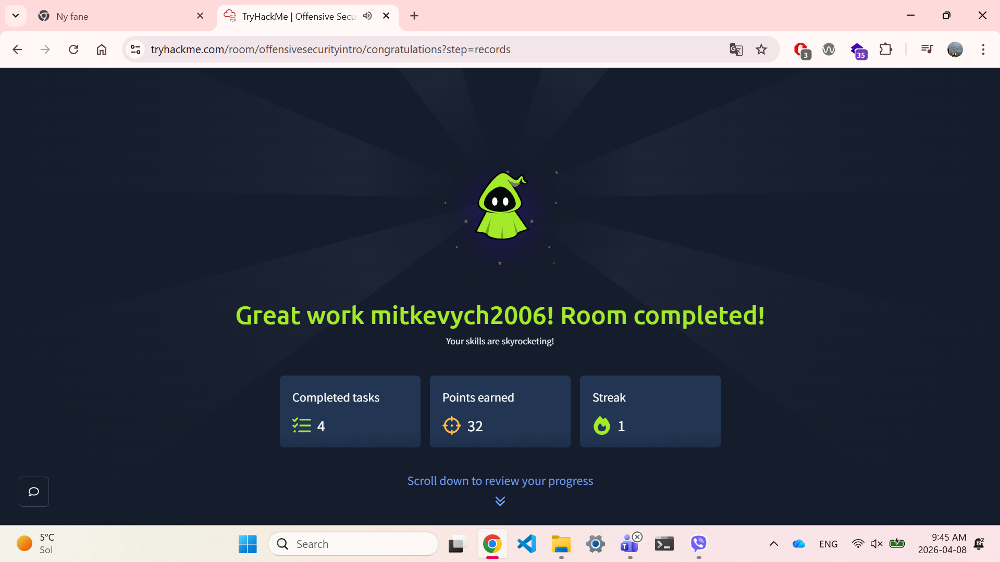
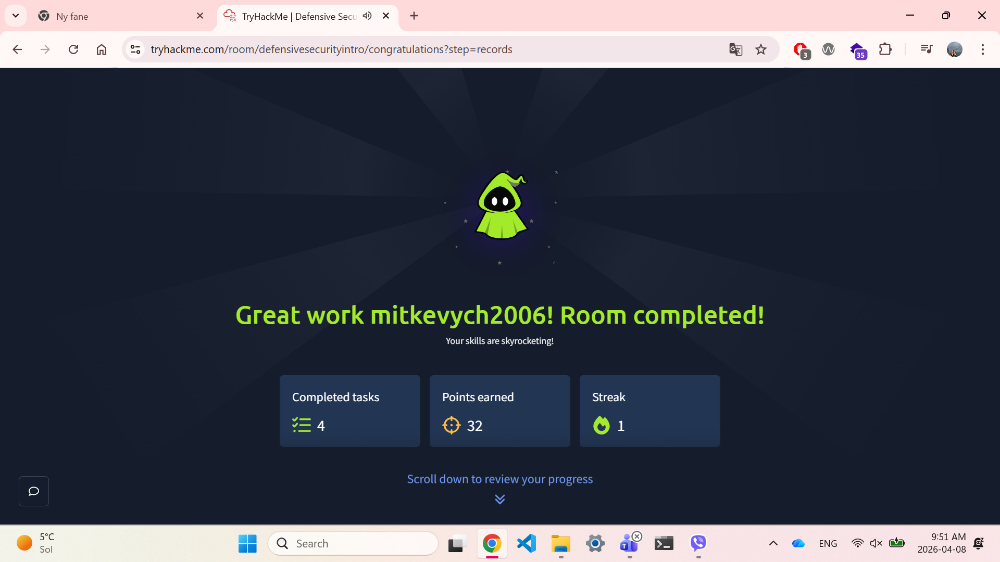
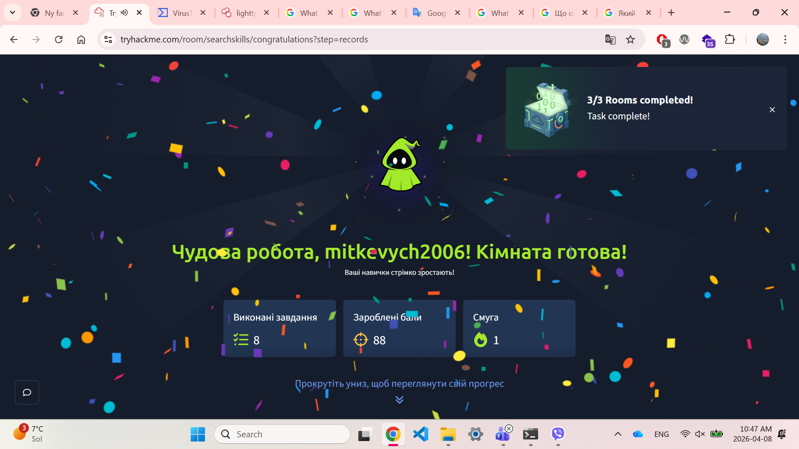
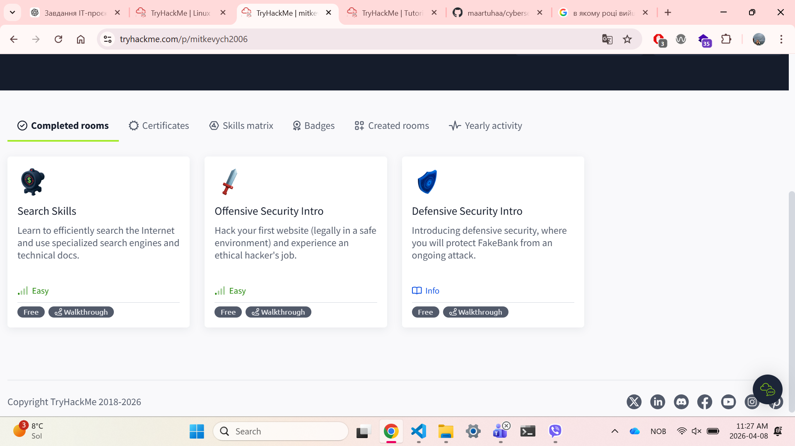
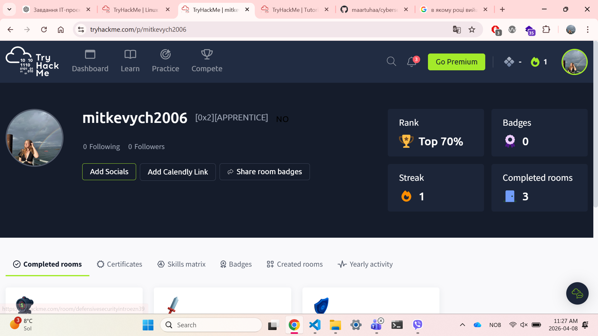

## 08.04.2026

### Hva jeg gjorde
I dag jobbet jeg med cybersikkerhet på TryHackMe.

Jeg fullførte disse rommene:
- Defensive Security Intro
- Search Skills
- Linux Fundamentals Part 1

Jeg lærte litt om hvordan man beskytter systemer, hvordan man søker etter teknisk informasjon, og noen grunnleggende Linux-kommandoer.

---

### Hva jeg lærte
- Grunnleggende om cybersikkerhet
- Hvordan søke bedre etter informasjon
- Enkle Linux-kommandoer (ls, cd, pwd)

---

### Utfordringer
Linux var litt vanskelig i starten, men det ble lettere etter hvert.

---

### Neste steg
Jeg er ferdig for i dag siden gratisversjonen 
har tidsbegrensning. Jeg fortsetter i morgen.

---
### Skjermbilder

