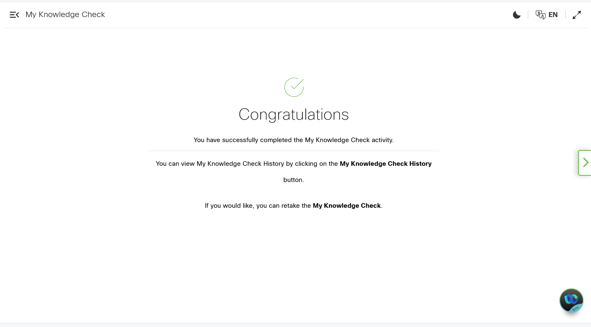
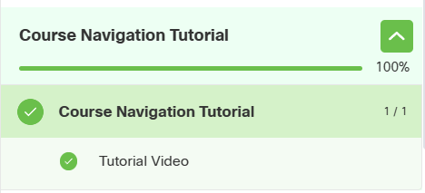
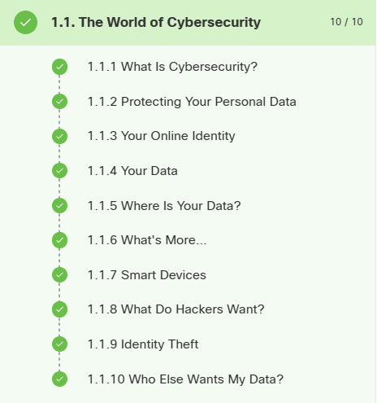
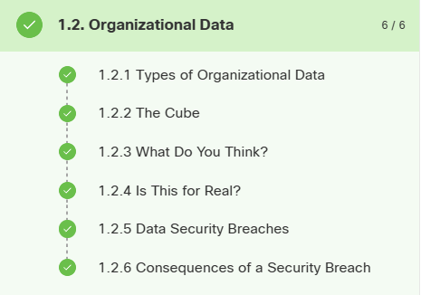
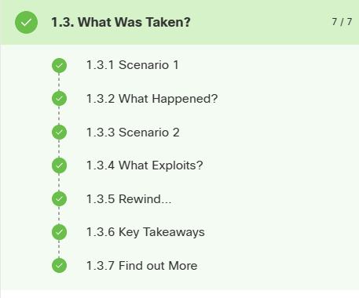
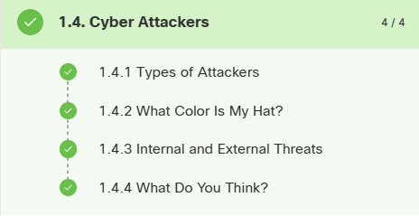
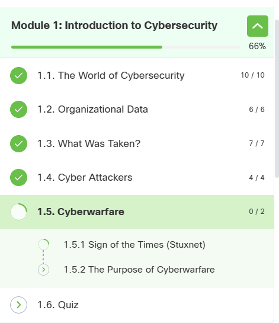

## 08.04.2026 

### Hva jeg gjorde
I dag jobbet jeg med cybersikkerhet på TryHackMe.

Jeg fullførte disse rommene:
- Defensive Security Intro
- Search Skills
- Linux Fundamentals Part 1

Jeg lærte litt om hvordan man beskytter systemer, hvordan man søker etter teknisk informasjon, og noen grunnleggende Linux-kommandoer.

---

### Hva jeg lærte
- Grunnleggende om cybersikkerhet
- Hvordan søke bedre etter informasjon
- Enkle Linux-kommandoer (ls, cd, pwd)

---

### Neste steg
Jeg er ferdig for i dag siden gratisversjonen 
har tidsbegrensning. Jeg fortsetter i morgen.

---
### Skjermbilder

## 09.04.2026

### Hva jeg gjorde
I dag begynte jeg å bruke Cisco Networking Academy i stedet for TryHackMe, siden gratis tilgang der var begrenset.

Jeg startet på kurset "Introduction to Cybersecurity" og jobbet med de første delene:
- The World of Cybersecurity
- Organizational Data

---

### Hva jeg lærte
- Hva cybersikkerhet er
- Hvordan data brukes i organisasjoner

---

### Utfordringer
Det var litt nye begreper, men det gikk greit.

---

### Skjermbilder

## 15.04.2026

### Hva jeg gjorde
I dag fortsatte jeg med kurset på Cisco Networking Academy.

Jeg jobbet med:
- What Was Taken?
- Cyber Attackers

Jeg lærte mer om hva som skjer i datainnbrudd og hvem som står bak angrep.

---

### Hva jeg lærte
- Hva som kan bli stjålet i et cyberangrep
- Ulike typer angripere

---

### Utfordringer
Noe var litt vanskelig å forstå, men jeg leste flere ganger.

---
### Skjermbilder

## 16.04.2026

### Hva jeg gjorde
I dag jobbet jeg videre med siste delen av modulen.

Jeg startet på:
- Cyberwarfare

---

### Hva jeg lærte
- Hva cyberkrig er
- At cybersikkerhet også brukes mellom land

---

### Utfordringer
Temaet var litt vanskelig, men jeg prøvde å forstå hovedpoengene.

---
### Skjermbilder

